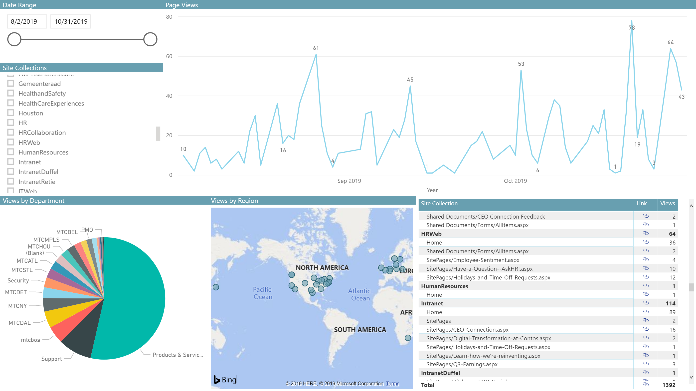
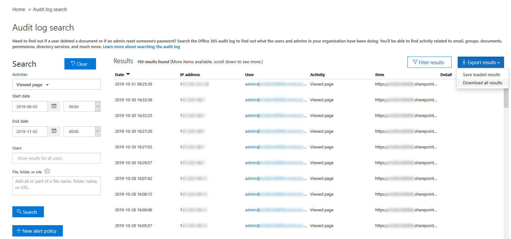
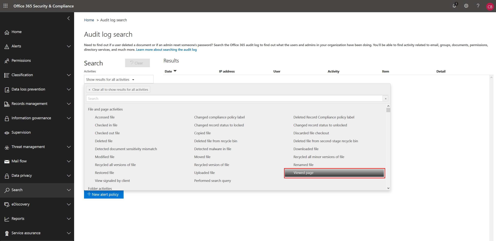

# SharePoint News Telemetry
Report on SharePoint Online New page views using the Office 365 Audit Log and Power BI

## Step 1: Export Audit Log data

## Step 2: Get your Office 365 Tenant Id
Prerequisites: you must be either a global administrator, report reader, Exchange administrator, Skype for Business administrator, or SharePoint administrator.

## Step 3: Download, update, and run the Power BI report
