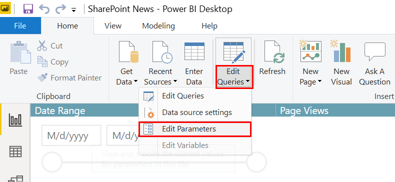
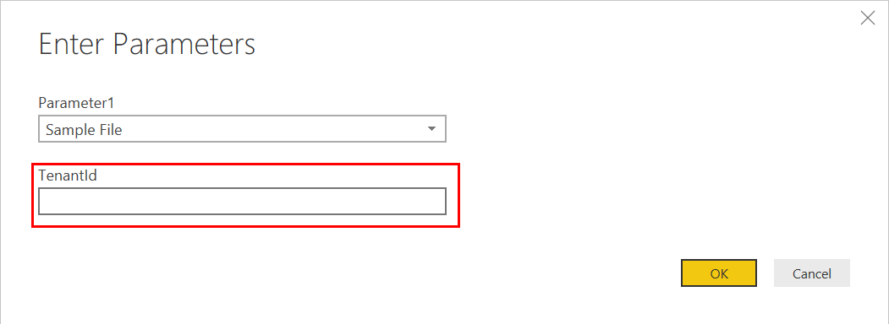
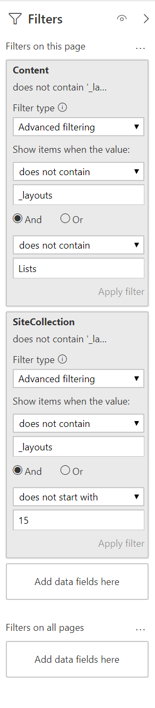

# SharePoint News Telemetry
Report on SharePoint Online News page views using the Office 365 Audit Log and Power BI. Not only will this report show News telemetry, but can be used for all/any pages in SharePoint Online.

## Step 1: Export Audit Log data
***Pre-requisites***: enable Office 365 audit log search: https://docs.microsoft.com/en-us/microsoft-365/compliance/turn-audit-log-search-on-or-off. You have to be assigned the Audit Logs role in Exchange Online to turn audit log search on or off in your Office 365 organization. By default, this role is assigned to the Compliance Management and Organization Management role groups on the Permissions page in the Exchange admin center. Global admins in Office 365 are members of the Organization Management role group in Exchange Online.

1. Select the **Viewed page** activity and apporpriate date range, then click the **Search** button

2. Once the search completed, **Download all results** via the **Export results** drop down in the upper right.

3. Move the file to C:\AuditLogExports

*Note*: you can search/export/download as many times as you want to refresh the report, but just ensure that the file names are unique and that the data time frames are unique (to avoid duplicate data). All files in the C:\AuditLogExports folder will be combined and used by the report upon refresh, as long as the format (columns) is the same.

## Step 2: Get your Office 365 Tenant Id
This step connects to the reports API used by the Microsoft 365 Usage Analytics report to get user information to power the Department and Region visual in the lower left hand portion of the report. If you don't have the necessary prerequisites or don't need this information, you can skip this step and delete those two visual.

***Pre-requisites***: you must be either a global administrator, report reader, Exchange administrator, Skype for Business administrator, or SharePoint administrator.

1. Follow these instructions to enable Microsoft 365 Usage Analytics and copy your Tenant Id for use in step 3: https://aka.ms/EnableM365UsageAnalytics

## Step 3: Download, update, and run the Power BI report
***Pre-requisites***: download and install Power BI Desktop (free): https://powerbi.microsoft.com/en-us/desktop/

1. Download the SharePoint News Telemetry report: https://github.com/cdbuzzell/SharePointNewsTelemetry/SharePoint%20News%20Telemetry.pbix

2. Download the sample AuditLog export file (https://github.com/cdbuzzell/SharePointNewsTelemetry/AuditLog.csv) and move to C:\AuditLogExports

3. Open the report in Power BI Desktop

4. From the Home tab, click **Edit Queries** -> **Edit Parameters**

5. Replace the Tenant Id parameter with yours from Step 2 above and click ok

6. Click the **Refresh** button on the Home tab to see data on the page

7. Tweak the Page filters as necessary to properly scope the pages you want to see in the report. As provided, the report will show more than just News articles, but won't show most system pages (_layouts, Lists). This is an area of improvement that you are welcome to contribute to. 
